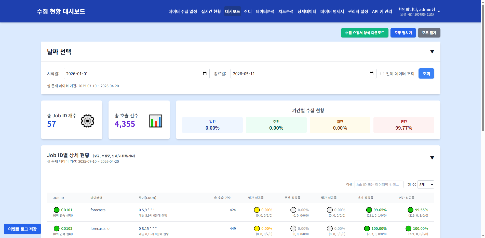
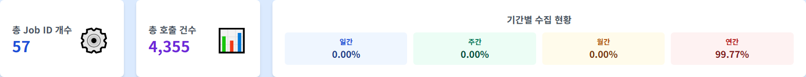
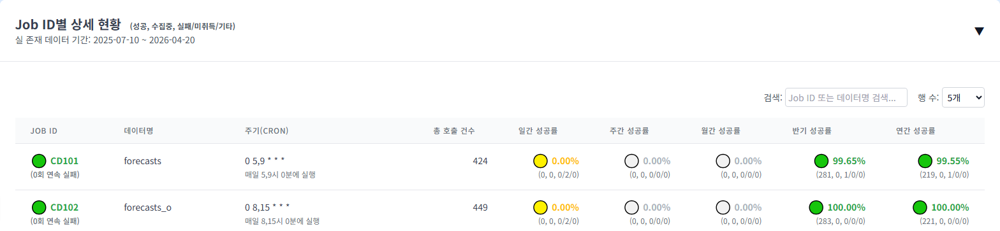
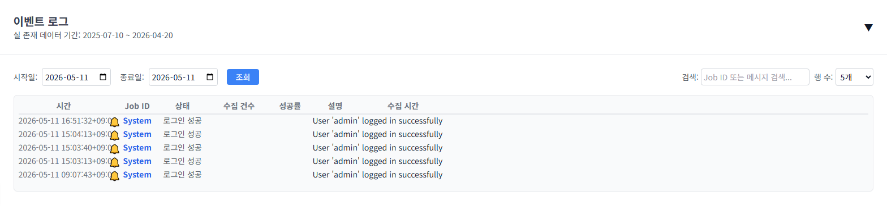

# 대시보드

> **핵심 기능**: 수집 작업의 전반적인 현황을 한눈에 모니터링하고, Job ID별 상세 성공률 및 이벤트 로그를 조회합니다.

---

## 1. 메뉴 접속 방법

- **경로**: 상단 메뉴 → 대시보드 (또는 `/` 루트 URL)
- **URL**: `/dashboard`
- **필요 권한**: `dashboard`
- **로그**: 메뉴 접근 시 `tb_user_acs_log` 테이블에 접근 이력이 기록됩니다.

---

## 2. 화면 구성

### 2.1 전체 화면 구조



### 2.2 각 영역 상세 설명

### 2.2 각 영역 상세 설명

#### ① 날짜 선택 카드 (`date-selection-card`)

| 요소 | ID | 설명 |
|------|-----|------|
| 시작일 | `startDate` | 조회 시작 날짜 (기본값: 올해 1월 1일) |
| 종료일 | `endDate` | 조회 종료 날짜 (기본값: 오늘) |
| 전체 데이터 조회 | `allDataCheckbox` | 체크 시 날짜 선택 없이 전체 기간 조회 |
| 조회 버튼 | - | 데이터를 다시 로드합니다 |
| 실 존재 데이터 기간 | `minDateDisplay` ~ `maxDateDisplay` | DB에 실제로 존재하는 데이터의 최소/최대 날짜 |

**동작 로직:**
- 페이지 진입 시 자동으로 올해 1월 1일 ~ 오늘(KST 기준)로 설정됩니다.
- `전체 데이터 조회` 체크 시 시작일/종료일 입력 필드가 비활성화되고, 전체 기간 데이터를 조회합니다.
- 날짜 변경 또는 체크박스 변경 시 자동으로 `loadDashboardSummary()`가 호출되어 데이터가 갱신됩니다.
- 조회 버튼 클릭 시에도 동일하게 데이터가 갱신됩니다.

**주의사항:**
- 시작일이 종료일보다 늦을 수 없습니다 (백엔드에서 400 에러 반환).
- 종료일은 실제로 `end_date + 1일`로 처리되어 해당 종료일까지의 데이터가 포함됩니다.

---

#### ② 요약 패널 (`dashboard-main-grid`)

##### 2.2.1 총 Job ID 개수 (`totalJobsCount`)

- **표시 내용**: 현재 조회된 데이터에서 활성화된 Job ID의 총 개수
- **계산 로직**: `summaryData.length` (CHRT_DSP_YN='N'으로 숨겨진 Job은 제외)
- **아이콘**: ⚙️ (톱니바퀴)



##### 2.2.2 총 호출 건수 (`totalCollectionsCount`)

- **표시 내용**: 전체 Job의 총 호출(수집 시도) 건수
- **계산 로직**: 모든 Job의 `(성공 + 실패 + 미수집)` 건수 합계
- **포맷**: 한글 단위 변환 (예: 12,345 → 1.2만)
- **아이콘**: 📊 (차트)

##### 2.2.3 기간별 수집 현황

일간/주간/월간/연간 성공률을 표시합니다.

| 기간 | ID | 계산식 | 기본 임계값 |
|------|-----|--------|------------|
| 일간 | `daySuccessRate` | 일간 성공 / (일간 성공 + 일간 실패 + 일간 미수집) × 100 | 95% |
| 주간 | `weekSuccessRate` | 주간 성공 / (주간 성공 + 주간 실패 + 주간 미수집) × 100 | 90% |
| 월간 | `monthSuccessRate` | 월간 성공 / (월간 성공 + 월간 실패 + 월간 미수집) × 100 | 85% |
| 반기 | `halfSuccessRate` | 반기 성공 / (반기 성공 + 반기 실패 + 반기 미수집) × 100 | 80% |
| 연간 | `yearSuccessRate` | 연간 성공 / (연간 성공 + 연간 실패 + 연간 미수집) × 100 | 75% |

**색상 기준:**
- 임계값 이상: `srSuccessColor` (기본 녹색 #28a745)
- 임계값 미만: `srWarningColor` (기본 노란색 #ffc107)

---

#### ③ Job ID별 상세 현황 테이블 (`job-details-card`)

**접이식 동작:** 카드 헤더를 클릭하면 내용이 접히거나 펼쳐집니다.

##### 테이블 컬럼 상세

| 컬럼 | 데이터 | 설명 |
|------|--------|------|
| **Job ID** | `job_id` | 수집 작업 고유 ID. 관리자는 Airflow 링크로 이동 가능 |
| **데이터명** | `cd_nm` | `tb_con_mst`의 코드명 |
| **주기(cron)** | `frequency` | 수집 주기 (cron 표현식). 하단에 해석된 텍스트 표시 |
| **총 호출 건수** | `overall_total` | 성공 + 실패 + 미수집 + 기타 건수 |
| **일간 성공률** | `day_success / day_total` | 오늘 기준 성공률. 아이콘 + 색상 + 툴팁 |
| **주간 성공률** | `week_success / week_total` | 최근 7일 기준 |
| **월간 성공률** | `month_success / month_total` | 최근 30일 기준 |
| **반기 성공률** | `half_success / half_total` | 최근 6개월 기준 |
| **연간 성공률** | `year_success / year_total` | 최근 1년 기준 |



##### Job ID 표시 로직

**아이콘 및 색상:**
- `cnn_failr_icon_id` + `cnn_failr_wrd_colr`: 연속 실패(임계값 초과) 시
- `cnn_warn_icon_id` + `cnn_warn_wrd_colr`: 연속 실패(경고 임계값) 시  
- `cnn_sucs_icon_id` + `cnn_sucs_wrd_colr`: 정상 시

**연속 실패 (`fail_streak`):**
- 최근 10회 실행 중 `CD902`(장애) 또는 `CD903`(미수집) 상태인 횟수
- 계산 쿼리: `SELECT COUNT(*) FROM (SELECT status FROM TB_CON_HIST WHERE job_id = ? ORDER BY start_dt DESC LIMIT 10) WHERE status IN ('CD902', 'CD903')`

**임계값 비교:**
- `fail_streak >= cnn_failr_thrs_val` (기본 3회): 위험(빨간색)
- `fail_streak >= cnn_warn_thrs_val` (기본 1회): 경고(노란색)
- 그 외: 정상(녹색)

##### 성공률 표시 로직

**성공률 계산:**
```
성공률 = success / (success + fail + no_data) × 100
```
- `no_data`(CD904, 진행중)는 분모에 포함되지 않음

**아이콘:**
- 임계값 이상: `sucs_rt_sucs_icon_id` (기본 없음)
- 임계값 미만: `sucs_rt_warn_icon_id` (기본 없음)

**하단 툴팁:**
```
(성공건수, 진행중건수, 실패건수/미수집건수/기타건수)
```

##### 검색 및 필터링

- **검색 (`detailTableSearch`)**: Job ID, 데이터명(`cd_nm`), 주기(`frequency`)로 실시간 필터링
- **행 수 (`detailTablePageSize`)**: 5/10/20/50/100개 선택 가능
- **페이징**: 하단 페이지네이션 버튼으로 이동

**필터링 로직:**
```javascript
filteredData = allData.filter(item => 
  item.job_id.toLowerCase().includes(searchTerm) ||
  item.cd_nm.toLowerCase().includes(searchTerm) ||
  item.frequency.toLowerCase().includes(searchTerm)
)
```


---

#### ④ 이벤트 로그 (`event-log-card`)

**접이식 동작:** 카드 헤더를 클릭하면 내용이 접히거나 펼쳐집니다.

##### 데이터 출처

- **테이블**: `tb_con_hist_evnt_log`
- **컬럼**: `EVNT_CHG_ROW` (JSONB)에서 추출
  - `con_id`: 수집 ID
  - `start_dt`: 시작 시간
  - `end_dt`: 종료 시간
  - `job_id`: Job ID
  - `rqs_info`: 요청 정보
  - `status`: 상태 코드

##### 상태 코드 정의

| 코드 | 의미 | 설명 | 아이콘 |
|------|------|------|--------|
| CD901 | 정상 수집 | 수집 완료 | 관리자 설정 아이콘 또는 🔔 |
| CD902 | 장애 발생 | 실패 | 관리자 설정 아이콘 또는 🔔 |
| CD903 | 미수집 | 데이터 없음 | 관리자 설정 아이콘 또는 🟠 |
| CD904 | 수집중 | 진행 중 | 관리자 설정 아이콘 또는 🔔 |
| AUTH_LOGIN_SUCCESS | 로그인 성공 | 시스템 이벤트 | - |
| AUTH_REGISTER | 가입 신청 | 시스템 이벤트 | - |
| AUTH_APPROVE | 가입 승인 | 시스템 이벤트 | - |
| AUTH_REJECT | 가입 거절 | 시스템 이벤트 | - |
| AUTH_DELETE | 사용자 삭제 | 시스템 이벤트 | - |
| AUTH_RESET_PW | 비밀번호 초기화 | 시스템 이벤트 | - |
| AUTH_CHANGE_PW | 비밀번호 변경 | 시스템 이벤트 | - |



##### 표시 컬럼

| 컬럼 | 내용 | 설명 |
|------|------|------|
| 시간 | `start_dt` | 이벤트 발생 시간 (KST) |
| 아이콘 | 상태별 아이콘 | 관리자 설정 또는 기본 아이콘 |
| Job ID | `job_id` | 작업 ID (시스템 이벤트는 'System') |
| 상태 | `status` → 해석 | CD901 → '정상 수집' 등 |
| 수집 건수 | `rqs_info` 파싱 | "총 요청 수: N, 실패: M"에서 추출 |
| 성공률 | 계산 | 성공 / 총 × 100 |
| 설명 | `status` → 해석 | '수집완료', '실패', '미수집', '진행중' |
| 수집 시간 | `end_dt - start_dt` | 소요 시간 (시간 단위, 소수점 1자리) |

##### 조작 기능

- **시작일/종료일 필터**: 날짜 변경 시 자동 조회
- **검색 (`eventLogSearch`)**: Job ID, 상태, 설명으로 실시간 필터링
- **행 수 (`eventLogPageSize`)**: 5/10/20/50/100개 선택
- **페이징**: 하단 페이지네이션
- **이벤트 로그 저장 버튼** (`save-event-log-btn`):
  - 현재 조회된 전체 이벤트 로그를 서버에 JSON으로 저장
  - API: `POST /api/save-event-log`
  - 저장 완료 시 파일 경로 표시 (2초 후 원래 텍스트로 복귀)

---

## 3. 데이터 흐름 및 처리 로직

### 3.1 전체 데이터 흐름도

```
[사용자] → [dashboard.html] → [dashboard.js] → [events.js]
                                              ↓
                              [fetchDashboardSummary()]
                                              ↓
                              [GET /api/dashboard/summary]
                                              ↓
                              [DashboardService.get_summary()]
                                              ↓
         ┌────────────────────────────────────┼────────────────────────────────────┐
         ↓                                    ↓                                    ↓
[DashboardMapper]              [CollectionScheduleService]              [MngrSettMapper]
         ↓                                    ↓                                    ↓
[DashboardSQL.get_summary()]   [get_schedule_only()]                   [get_all_settings()]
         ↓                                    ↓                                    ↓
[TB_CON_HIST] (과거 데이터)     [TB_CON_HIST] + [스케줄] (오늘 데이터)      [TB_MNGR_SETT]
         └────────────────────────────────────┼────────────────────────────────────┘
                                              ↓
                              [_combine_historical_and_today_data()]
                                              ↓
                              [_apply_settings_and_filters()] (CHRT_DSP_YN 필터)
                                              ↓
                              [_add_fail_streaks()] (연속 실패 계산)
                                              ↓
                              [JSON 응답] → [updateSummaryCards()] + [renderDashboardSummaryTable()]
```

### 3.2 오늘 데이터 처리 상세

**CollectionScheduleService.get_schedule_only():**
- 오늘(KST 기준)의 수집 스케줄을 조회
- 상태 코드 분류:
  - `CD901`: 성공
  - `CD902`, `CD903`: 실패
  - `CD904`: 진행 중
  - 기타: 미수집
  - `CD907`: 스케줄 제외 (total_scheduled에서 제외)

**병합 로직:**
- 과거 데이터(`TB_CON_HIST`)와 오늘 데이터를 Job ID 기준으로 병합
- 오늘 데이터는 `day_*` 필드에 저장 (day_success, day_fail_count, day_ing_count, day_no_data_count, day_total_scheduled)
- 과거 데이터는 `week_*`, `month_*`, `half_*`, `year_*` 필드에 저장

### 3.3 관리자 설정 적용

**`tb_mngr_sett` 설정 항목:**

| 설정 항목 | 컬럼명 | 기본값 | 설명 |
|-----------|--------|--------|------|
| 대시보드 표시 여부 | `CHRT_DSP_YN` | Y | N인 경우 대시보드에서 제외 |
| 연속 실패 임계값(위험) | `cnn_failr_thrs_val` | 3 | 이 횟수 이상 연속 실패 시 빨간색 |
| 연속 실패 임계값(경고) | `cnn_warn_thrs_val` | 1 | 이 횟수 이상 연속 실패 시 노란색 |
| 연속 실패 성공 아이콘 | `cnn_sucs_icon_id` | - | 정상 상태 아이콘 |
| 연속 실패 경고 아이콘 | `cnn_warn_icon_id` | - | 경고 상태 아이콘 |
| 연속 실패 위험 아이콘 | `cnn_failr_icon_id` | - | 위험 상태 아이콘 |
| 일간 성공률 임계값 | `dly_sucs_rt_thrs_val` | 95 | % |
| 주간 성공률 임계값 | `dd7_sucs_rt_thrs_val` | 90 | % |
| 월간 성공률 임계값 | `mthl_sucs_rt_thrs_val` | 85 | % |
| 반기 성공률 임계값 | `mc6_sucs_rt_thrs_val` | 80 | % |
| 연간 성공률 임계값 | `yy1_sucs_rt_thrs_val` | 75 | % |
| 성공률 성공 아이콘 | `sucs_rt_sucs_icon_id` | - | 임계값 이상 아이콘 |
| 성공률 경고 아이콘 | `sucs_rt_warn_icon_id` | - | 임계값 미만 아이콘 |

---

## 4. 조작 방법

### 4.1 날짜 범위 변경하여 조회

**조작 절차:**
1. `시작일` 입력 필드 클릭 → 날짜 선택
2. `종료일` 입력 필드 클릭 → 날짜 선택
3. `조회` 버튼 클릭 (또는 Enter)
4. 요약 패널과 상세 테이블이 자동 갱신됨

**확인 방법:**
- 요약 패널의 숫자가 변경되는지 확인
- 상세 테이블의 데이터가 갱신되는지 확인
- 상단에 초록색 토스트 메시지 "대시보드 요약 업데이트 완료" 표시

### 4.2 전체 기간 조회

**조작 절차:**
1. `전체 데이터 조회` 체크박스 클릭
2. 시작일/종료일 필드가 비활성화됨
3. 데이터가 자동으로 갱신됨

### 4.3 Job ID 검색

**조작 절차:**
1. 상세 테이블 우측 상단 `검색` 입력 필드에 텍스트 입력
2. 입력 즉시(Job ID, 데이터명, 주기 중 하나라도 포함) 필터링됨

### 4.4 이벤트 로그 조회

**조작 절차:**
1. `이벤트 로그` 카드 펼치기 (헤더 클릭)
2. 시작일/종료일 설정
3. `조회` 버튼 클릭
4. 이벤트 로그 목록 확인

### 4.5 이벤트 로그 저장

**조작 절차:**
1. 이벤트 로그 조회
2. 좌측 하단 `이벤트 로그 저장` 버튼 클릭
3. `저장 완료: [파일경로]` 메시지 확인

**주의사항:**
- 저장할 데이터가 없으면 "저장할 이벤트 로그 데이터가 없습니다" 경고 표시
- 저장 실패 시 "저장 실패" 표시 (2초 후 원래 텍스트로 복귀)


---

## 5. 모니터링 체크리스트

- [ ] **총 Job ID 개수**가 예상 범위 내인지 확인 (보통 100~200개)
- [ ] **총 호출 건수**가 0이 아닌지 확인
- [ ] **일간 성공률**이 95% 이상인지 확인
- [ ] **주간 성공률**이 90% 이상인지 확인
- [ ] **연속 실패**가 3회 이상인 Job(빨간색)이 있는지 확인
- [ ] **이벤트 로그**에 비정상적인 에러가 없는지 확인
- [ ] `전체 데이터 조회` 시에도 데이터가 로드되는지 확인

---

## 6. 자주 발생하는 문제

| 증상 | 원인 | 해결 방법 |
|------|------|-----------|
| 대시보드가 비어있음 (데이터 없음) | 날짜 범위 내 데이터 없음 | 전체 데이터 조회 체크 또는 날짜 범위 확대 |
| 특정 Job이 표시되지 않음 | `CHRT_DSP_YN='N'` 설정됨 | 관리자 설정 → 해당 Job의 대시보드 표시 여부 확인 |
| 성공률이 0%로 표시됨 | 해당 기간 내 수집 이력 없음 | 데이터 수집 스케줄/에이전트 상태 확인 |
| 연속 실패 횟수가 이상함 | 상태 코드 분류 오류 | `tb_sts_cd_mst`의 성공/실패 코드 설정 확인 |
| 이벤트 로그에 AUTH_ 이벤트만 있음 | 비관리자 계정으로 조회 | 관리자 권한 확인 (비관리자는 시스템 이벤트 필터링됨) |
| 이벤트 로그 저장 실패 | 서버 디스크 공간 부족 | 서버 디스크 여유 공간 확인 |

---

## 7. 관련 DB 테이블 및 쿼리

### 7.1 주요 테이블

| 테이블 | 설명 |
|--------|------|
| `tb_con_hist` | 수집 실행 이력 (Job ID별 성공/실패 상태) |
| `tb_con_hist_evnt_log` | 이벤트 로그 (JSONB 형태로 변경 전/후 데이터 저장) |
| `tb_con_mst` | 수집 작업 마스터 (Job ID, 주기, 데이터명) |
| `tb_mngr_sett` | 관리자 설정 (성공률 임계값, 색상, 아이콘) |
| `tb_icon` | 아이콘 마스터 |
| `tb_user_data_perm_auth_ctrl` | 사용자별 데이터 접근 권한 |

### 7.2 연속 실패 계산 쿼리

```sql
SELECT COUNT(*) as fail_count
FROM (
    SELECT status
    FROM TB_CON_HIST
    WHERE job_id = ?
    ORDER BY start_dt DESC
    LIMIT 10
) recent_runs
WHERE status IN ('CD902', 'CD903')
```

### 7.3 이벤트 로그 조회 쿼리

```sql
SELECT
    (EVNT_CHG_ROW ->> 'con_id')::text AS con_id,
    EVNT_OCCR_TIME AS start_dt,
    (EVNT_CHG_ROW ->> 'end_dt')::timestamptz AS end_dt,
    (EVNT_CHG_ROW ->> 'job_id')::text AS job_id,
    (EVNT_CHG_ROW ->> 'rqs_info')::text AS rqs_info,
    (EVNT_CHG_ROW ->> 'status')::text AS status
FROM TB_CON_HIST_EVNT_LOG
WHERE EVNT_OCCR_TIME >= ? AND EVNT_OCCR_TIME <= ?
ORDER BY EVNT_OCCR_TIME DESC
```

---

> 다음 문서: [02-collection-schedule.md](02-collection-schedule.md)
