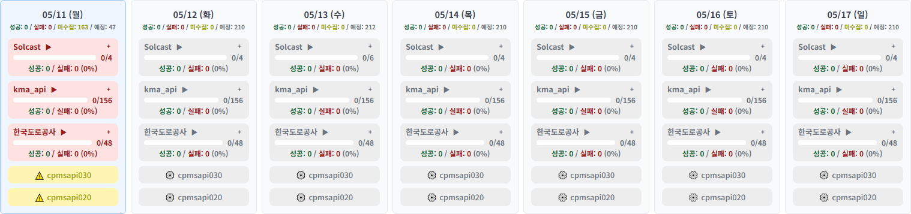
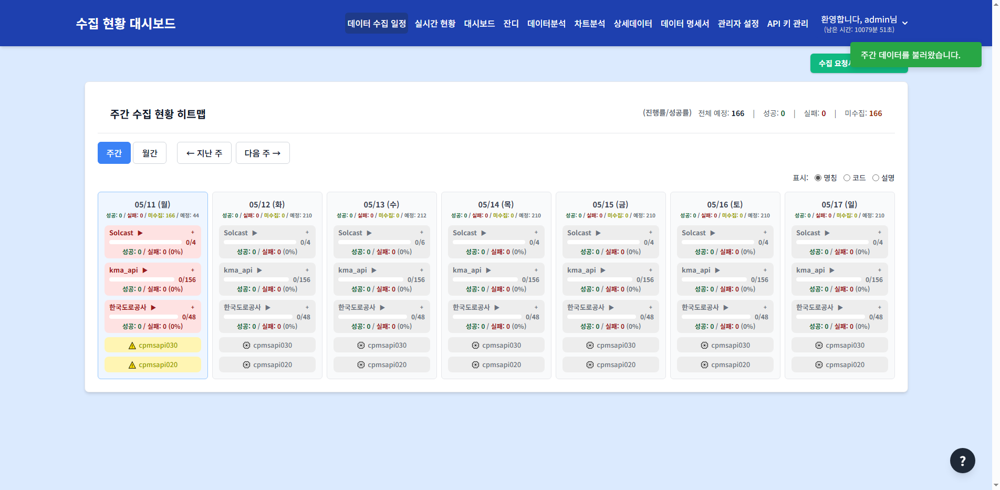

# 데이터 수집 일정

> **핵심 기능**: 주간/월간 단위로 데이터 수집 작업의 예정 및 실제 실행 상태를 히트맵 형태로 모니터링하고, 그룹별/Job별 상세 현황과 메모를 관리합니다.

---

## 1. 메뉴 접속 방법

- **경로**: 상단 메뉴 → 수집 스케줄
- **URL**: `/collection_schedule`
- **필요 권한**: `collection_schedule`
- **로그**: 메뉴 접근 시 `tb_user_acs_log` 테이블에 접근 이력이 기록됩니다.

---

## 2. 화면 구성

### 2.1 전체 화면 구조


### 2.2 각 영역 상세 설명

#### ① 히트맵 컨테이너 (`.heatmap-container`)

| 요소 | 선택자 | 설명 |
|------|--------|------|
| 제목 | `.card-title` | "주간 수집 현황 히트맵" 또는 "월간 수집 현황 히트맵" |
| 요약 통계 | `.summary-stats` | 전체 예정 / 성공 / 실패 / 미수집 건수 |
| 캘린더 그리드 | `#calendar-grid` | 7열(주간) 또는 N열(월간) 그리드 |
| 설정 패널 | `#settings-container` | 그룹화 임계값, 색상 기준 (기본 접힘) |

#### ② 컨트롤 영역 (`.controls`)

| 요소 | ID | 설명 |
|------|-----|------|
| 주간 버튼 | `#weekly-btn` | 주간 뷰로 전환 (기본값) |
| 월간 버튼 | `#monthly-btn` | 월간 뷰로 전환 |
| 이전 주 | `#prev-week-btn` | 한 주 이전으로 이동 |
| 다음 주 | `#next-week-btn` | 한 주 이후로 이동 |
| 이전 달 | `#prev-month-btn` | 한 달 이전으로 이동 |
| 다음 달 | `#next-month-btn` | 한 달 이후로 이동 |

**동작 로직:**
- 버튼 클릭 시 `week_offset` 또는 `month_offset` 값이 증감
- `/api/collection_schedule?week_offset=N` API 호출
- 응답 데이터로 캘린더 그리드 재렌더링


#### ③ 캘린더 그리드 (`#calendar-grid`)

**Day 열 구조:**
```
┌──────────────┐
│ 월 01/13     │  ← .day-header (요일 + 날짜)
├──────────────┤
│ [CD101]      │  ← .job-pill (단일 Job)
│ [CD102]      │     상태별 색상: 초록(성공), 빨강(실패), 주황(미수집)
│ [그룹A ▶]    │  ← .group-pill-summary (그룹화된 Job)
│  진행률 ████ │     마우스 오버 시 팝업으로 상세 Job 목록 표시
└──────────────┘
```

**Job 상태별 색상:**
| 상태 | 클래스 | 색상 | 의미 |
|------|--------|------|------|
| 성공 | `.status-success` | 배경: #dcfce7, 글자: #166534 | 수집 완료 |
| 실패 | `.status-fail` | 배경: #fee2e2, 글자: #991b1b | 수집 실패 |
| 미수집 | `.status-nodata` | 배경: #ffedd5, 글자: #9a3412 | 데이터 없음 |
| 진행중 | `.status-inprogress` | 배경: #fef9c3, 글자: #854d0e | 수집 진행 중 |
| 예정 | `.status-scheduled` | 배경: #e5e7eb, 글자: #4b5563 | 아직 실행 전 |



#### ④ 그룹 팝업 (`.popup`)



**표시 조건:** 그룹화된 Job 셀에 마우스 오버
**표시 내용:**
- 그룹 내 개별 Job 목록 (페이징 지원)
- 각 Job의 상태별 색상 유지
- 페이지네이션: ← 1 / 3 →

#### ⑤ 표시 모드 선택 (`#display-mode-selector`)

| 모드 | 값 | 표시 내용 |
|------|-----|----------|
| 명칭 | `name` | Job의 한글 이름 (`cd_nm`) |
| 코드 | `code` | Job ID (예: CD101) |
| 설명 | `desc` | Job 상세 설명 |

#### ⑥ 그룹 메모 팝업 (`#memo-popup`)

**표시 조건:** 그룹 셀 더블클릭 (관리자만)
**기능:**
- 메모 작성/수정/삭제
- 작성자, 작성일시 표시
- 그룹 ID, 날짜 자동 매핑

#### ⑦ 가이드 버튼 (`#guide-toggle-btn`)

**위치:** 화면 우측 하단 고정 (원형 `?` 버튼)
**표시 내용:**
- 그룹 항목 색상 가이드 (상태별 색상 코드)
- 상세 데이터 상태 가이드


---

## 3. 데이터 흐름 및 처리 로직

### 3.1 전체 데이터 흐름도

```
[사용자] → [collection_schedule.html] → [collection_schedule.js]
                                              ↓
                           [fetch('/api/collection_schedule')]
                                              ↓
                           [collection_schedule_routes.py]
                                              ↓
                           [CollectionScheduleService.get_schedule_only()]
                                              ↓
          ┌───────────────────────────────────┼───────────────────────────────────┐
          ↓                                   ↓                                   ↓
 [_generate_scheduled_tasks()]    [_fetch_and_group_history_data()]    [MngrSettService]
          ↓                                   ↓                                   ↓
 [cron + tb_con_mst]                [DashboardMapper]                   [tb_mngr_sett]
          ↓                                   ↓                                   ↓
 예정된 스케줄 생성                   TB_CON_HIST 조회 (실제 실행 기록)    그룹화 임계값
          └───────────────────────────────────┼───────────────────────────────────┘
                                              ↓
                           [_match_schedule_with_history()]
                                              ↓
                           날짜별 순차 매칭 → 상태 결정
                                              ↓
                           [JSON 응답] → [캘린더 그리드 렌더링]
```

### 3.2 주요 처리 단계

**1단계: 스케줄 생성 (`_generate_scheduled_tasks`)**
- `tb_con_mst`의 cron 표현식 기반
- 시작일~종료일 범위 내 예정된 실행 시간 계산
- 사용자 권한에 따른 Job 필터링

**2단계: 히스토리 조회 (`_fetch_and_group_history_data`)**
- `tb_con_hist`에서 실제 수집 기록 조회
- KST 기준 날짜로 그룹화 (`date_key + job_id`)
- 상태 코드: CD901(성공), CD902(실패), CD903(미수집), CD904(진행중)

**3단계: 매칭 (`_match_schedule_with_history`)**
- 날짜별로 스케줄과 히스토리를 시간순 정렬
- 순차 매칭: 예정 시간과 실제 실행 시간 비교
- 5분 허용 시간(Grace Period) 내 실행 → 성공으로 처리
- 자정 경계 문제 해결: 날짜 비교 제거, 시간 차이만 비교

**4단계: 그룹화**
- 관리자 설정의 `grouping_threshold` 기준
- 일정 개수 이상인 Job ID 접두사로 그룹화
- 그룹 진행률 = (성공+진행중) / 전체 × 100

---

## 4. 조작 방법

### 4.1 주간/월간 뷰 전환

**조작 절차:**
1. `주간` 또는 `월간` 버튼 클릭
2. 캘린더 그리드가 즉시 전환됨

**확인 방법:**
- 버튼 활성화 상태(파란색) 변경
- 제목이 "주간 수집 현황 히트맵" → "월간 수집 현황 히트맵"으로 변경
- 캘린더 열 개수 변경 (7열 → 월 전체)

### 4.2 날짜 이동

**조작 절차:**
1. `← 지난 주` / `다음 주 →` 버튼 클릭
2. 또는 `← 지난달` / `다음달 →` 버튼 클릭

**확인 방법:**
- Day 헤더의 날짜가 변경됨
- 캘린더 그리드 데이터 갱신

### 4.3 표시 모드 변경

**조작 절차:**
1. 하단 `표시:` 라디오 버튼 그룹에서 선택
2. 명칭 / 코드 / 설명 중 선택

**확인 방법:**
- Job 셀의 텍스트가 즉시 변경됨

### 4.4 그룹 상세 보기

**조작 절차:**
1. 그룹화된 셀(예: `[그룹A ▶]`)에 마우스 오버
2. 팝업으로 개별 Job 목록 표시
3. 팝업 내 페이지네이션으로 추가 Job 확인

### 4.5 그룹 메모 작성 (관리자 전용)

**조작 절차:**
1. 그룹 셀 더블클릭
2. 메모 작성 팝업 표시
3. 텍스트 입력 후 `저장` 버튼 클릭

**확인 방법:**
- 저장 완료 시 토스트 메시지 "메모가 저장되었습니다"
- 메모가 있는 그룹 셀에 시각적 표시

### 4.6 수집 요청서 양식 다운로드

**조작 절차:**
1. 우측 상단 `수집 요청서 양식 다운로드` 버튼 클릭
2. Excel 파일(.xlsx) 다운로드

---

## 5. 모니터링 체크리스트

- [ ] **전체 예정 건수**가 0이 아닌지 확인
- [ ] **성공률**이 90% 이상인지 확인
- [ ] **미수집 건수**가 급증하지 않는지 확인
- [ ] **특정 Job/그룹**이 연속 실패하는지 확인
- [ ] **그룹 메모**가 최신 상태인지 확인
- [ ] **캘린더 이동** 시 데이터가 정상 로드되는지 확인

---

## 6. 자주 발생하는 문제

| 증상 | 원인 | 해결 방법 |
|------|------|-----------|
| 히트맵이 비어있음 | 데이터 수집 기록 없음 | 날짜 범위 확대 또는 데이터 수집 에이전트 상태 확인 |
| Job이 표시되지 않음 | 사용자 데이터 권한 없음 | 관리자에게 데이터 접근 권한 요청 |
| 그룹 진행률이 이상함 | 그룹화 임계값 부적절 | 관리자 설정에서 `grouping_threshold` 조정 |
| 미수집이 과다함 | 수집 에이전트 장애 또는 스케줄 미등록 | `tb_con_mst`의 cron 설정 및 에이전트 로그 확인 |
| 팝업이 표시되지 않음 | 그룹화되지 않은 단일 Job | 단일 Job은 팝업 없이 직접 상태 표시 |
| 메모 저장 실패 | 관리자 권한 없음 | 관리자 계정으로 로그인 확인 |

---

## 7. 관련 DB 테이블 및 쿼리

### 7.1 주요 테이블

| 테이블 | 설명 |
|--------|------|
| `tb_con_hist` | 수집 실행 이력 (실제 성공/실패 상태) |
| `tb_con_mst` | 수집 작업 마스터 (Job ID, cron 주기, 그룹 정보) |
| `tb_mngr_sett` | 관리자 설정 (그룹화 임계값, 색상 기준) |
| `tb_grp_memo` | 그룹 메모 (그룹 ID, 날짜, 내용, 작성자) |
| `tb_user_data_perm_auth_ctrl` | 사용자별 데이터 접근 권한 |

### 7.2 스케줄 조회 API

```
GET /api/collection_schedule?view=weekly&week_offset=0
GET /api/collection_schedule?view=monthly&month_offset=0
```

**응답 구조:**
```json
[
  {
    "job_id": "CD101",
    "date": "2025-12-18",
    "status": "success",
    "scheduled_time": "06:30",
    "is_grouped": false
  },
  {
    "group_id": "GRP_A",
    "date": "2025-12-18",
    "progress": 85,
    "jobs": ["CD201", "CD202"],
    "is_grouped": true
  }
]
```

---

> 다음 문서: [03-chart-analysis.md](03-chart-analysis.md)
