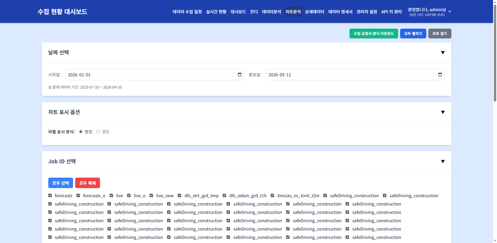
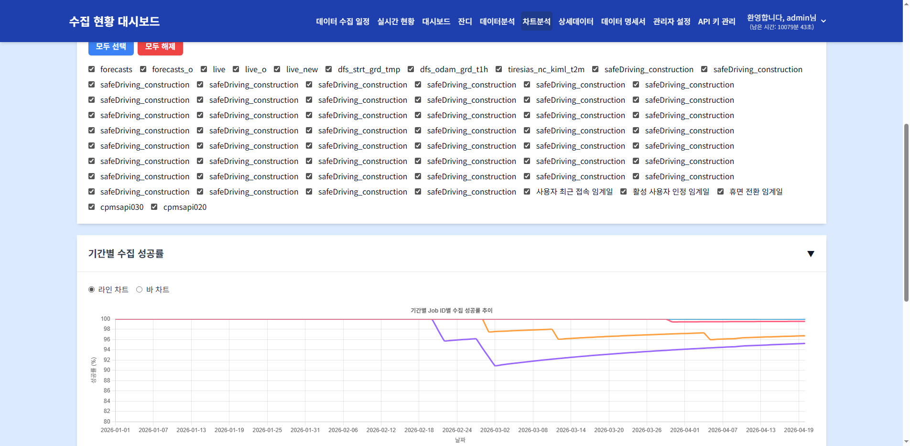

# 차트 분석

> **핵심 기능**: 선택한 기간과 Job ID를 기준으로 수집 성공률 추이와 장애 코드별 비율을 차트로 시각화하여 분석합니다.

---

## 1. 메뉴 접속 방법

- **경로**: 상단 메뉴 → 차트 분석
- **URL**: `/chart_analysis`
- **필요 권한**: `analysis`
- **로그**: 메뉴 접근 시 `tb_user_acs_log` 테이블에 접근 이력이 기록됩니다.

---

## 2. 화면 구성

### 2.1 전체 화면 구조



### 2.2 각 영역 상세 설명

#### ① 날짜 선택 카드 (`#date-selection-card-chart`)

| 요소 | ID | 설명 |
|------|-----|------|
| 시작일 | `#startDate` | 조회 시작 날짜 |
| 종료일 | `#endDate` | 조회 종료 날짜 |
| 실 존재 데이터 기간 | `#chart-min-date` ~ `#chart-max-date` | DB에 실제로 존재하는 데이터의 최소/최대 날짜 |

**동작 로직:**
- 페이지 진입 시 자동으로 올해 1월 1일 ~ 오늘(KST 기준)로 설정됩니다.
- 날짜 변경 시 차트 데이터가 자동으로 갱신됩니다.
- `collapsible_controls.html` 공통 모듈을 사용하여 접이식 동작을 제공합니다.

#### ② 차트 표시 옵션 카드 (`#chart-options-card`)

| 옵션 | 값 | 설명 |
|------|-----|------|
| 라벨 표시 방식 | `name` | Job의 한글 이름 (`cd_nm`) 표시 |
| 라벨 표시 방식 | `code` | Job ID (예: CD101) 표시 |

**동작 로직:**
- 라디오 버튼 변경 시 모든 차트의 범례와 툴팁 라벨이 즉시 변경됩니다.
- `chart_analysis.js`의 `labelDisplayType` 이벤트 리스너에서 처리합니다.

#### ③ Job ID 선택 카드 (`#job-selection-card-chart`)

| 요소 | 설명 |
|------|------|
| 모두 선택 버튼 | 모든 Job ID 체크박스 선택 |
| 모두 해제 버튼 | 모든 Job ID 체크박스 해제 |
| 개별 체크박스 | `#jobCheckboxes` 낸 각 Job ID별 체크박스 |

**동작 로직:**
- 페이지 진입 시 `tb_con_mst`의 모든 Job ID를 체크박스로 로드합니다.
- 사용자 권한(`data_permissions`)에 따라 표시되는 Job이 필터링됩니다.
- 체크박스 변경 시 차트 데이터가 자동으로 갱신됩니다.



#### ④ 기간별 수집 성공률 차트 (`#success-rate-chart-card`)

| 요소 | 설명 |
|------|------|
| 차트 유형 선택 | 라인 차트 / 바 차트 전환 |
| 차트 캔버스 | `#successRateChart` (Chart.js) |
| 범례 영역 | `#successRateLegend` (세로 스크롤 지원, 최대 높이 180px) |

**데이터 출처:**
- API: `GET /api/chart_data` (또는 `/api/analysis/chart`)
- Service: `AnalysisService.get_dynamic_chart_data()`
- Mapper: `AnalysisMapper.get_dynamic_chart_data()`
- SQL: `sql/analytics/analytics_sql.py`

**차트 데이터 구조:**
```json
[
  {
    "job_id": "CD101",
    "date": "2025-01",
    "success_rate": 95.5,
    "success_count": 100,
    "fail_count": 5,
    "total_count": 105
  }
]
```

**색상 및 스타일:**
- 각 Job ID별 고유 색상 자동 할당
- 라인 차트: `tension: 0.3` (부드러운 곡선)
- 바 차트: `barPercentage: 0.7`
- 범례: 하단 세로 스크롤, 가로 배치 (`flex-wrap: wrap`)

#### ⑤ 장애 코드별 비율 차트 (`#trouble-code-chart-card`)

| 요소 | 설명 |
|------|------|
| 차트 유형 선택 | 도넛 차트 / 바 차트 전환 |
| 차트 캔버스 | `#troublePieChart` (Chart.js) |

**데이터 출처:**
- `tb_con_hist`의 `status` 컬럼 집계
- 선택된 기간 및 Job ID 필터 적용

**표시 데이터:**
| 상태 코드 | 의미 | 색상 |
|-----------|------|------|
| CD901 | 정상 수집 | 녹색 계열 |
| CD902 | 장애 발생 | 빨간색 계열 |
| CD903 | 미수집 | 주황색 계열 |
| CD904 | 수집중 | 노란색 계열 |
| 기타 | 기타 상태 | 회색 계열 |

---

## 3. 데이터 흐름 및 처리 로직

### 3.1 전체 데이터 흐름도

```
[사용자] → [chart_analysis.html] → [chart_analysis.js]
                                              ↓
                          [fetch('/api/chart_data')]
                                              ↓
                          [analysis_routes.py]
                                              ↓
                          [AnalysisService.get_dynamic_chart_data()]
                                              ↓
          ┌───────────────────────────────────┼───────────────────────────────────┐
          ↓                                   ↓                                   ↓
 [AnalysisMapper]              [UserMapper]                    [MstMapper]
          ↓                                   ↓                                   ↓
 [sql/analytics/analytics_sql.py]  [data_permissions 조회]         [Job ID 목록]
          ↓                                   ↓                                   ↓
 [TB_CON_HIST] 집계            [TB_USER_DATA_PERM_AUTH_CTRL]    [TB_CON_MST]
          └───────────────────────────────────┼───────────────────────────────────┘
                                              ↓
                           [JSON 응답] → [Chart.js 렌더링]
```

### 3.2 성공률 계산 로직

```
성공률 = (성공 건수 / (성공 건수 + 실패 건수 + 미수집 건수)) × 100
```
- `CD904`(진행중)은 분모에 포함되지 않음
- 기간별(월간/주간/일간) 그룹화는 SQL의 `GROUP BY`로 처리

### 3.3 권한 필터링

**관리자(`mngr_sett`):**
- 모든 Job ID 조회 가능
- 요청된 `job_ids` 파라미터 그대로 사용

**일반 사용자:**
- `TB_USER_DATA_PERM_AUTH_CTRL`에서 허용된 Job ID만 조회
- 요청된 `job_ids`와 교집합(intersection)으로 필터링

---

## 4. 조작 방법

### 4.1 날짜 범위 변경

**조작 절차:**
1. `시작일` 입력 필드 클릭 → 날짜 선택
2. `종료일` 입력 필드 클릭 → 날짜 선택
3. 차트가 자동으로 갱신됨

**확인 방법:**
- 차트의 X축(날짜 범위)이 변경되는지 확인
- 데이터 포인트 개수가 변경되는지 확인

### 4.2 Job ID 필터링

**조작 절차:**
1. `Job ID 선택` 카드 펼치기 (헤더 클릭)
2. 체크박스로 표시할 Job ID 선택/해제
3. 또는 `모두 선택` / `모두 해제` 버튼 사용

**확인 방법:**
- 차트에 표시되는 선/막대 개수가 변경됨
- 범례 목록이 변경됨

### 4.3 차트 유형 전환

**조작 절차:**
1. `기간별 수집 성공률` 또는 `장애 코드별 비율` 카드 펼치기
2. `라인 차트` / `바 차트` 또는 `도넛 차트` / `바 차트` 라디오 버튼 선택

**확인 방법:**
- 차트가 즉시 해당 유형으로 변경됨
- 라인 차트 → 선 그래프, 바 차트 → 막대 그래프, 도넛 차트 → 원형 그래프

### 4.4 라벨 표시 방식 변경

**조작 절차:**
1. `차트 표시 옵션` 카드 펼치기
2. `명칭` 또는 `코드` 라디오 버튼 선택

**확인 방법:**
- 차트 범례의 Job 이름이 변경됨 (예: "CD101" → "기상청예보")
- 툴팁의 라벨도 동일하게 변경됨

---

## 5. 모니터링 체크리스트

- [ ] **성공률 추이**가 안정적인지 확인 (급격한 하락 여부)
- [ ] **특정 Job**의 성공률이 지속적으로 낮은지 확인
- [ ] **장애 코드 비율**에서 CD902(장애) 비율이 높지 않은지 확인
- [ ] **데이터 기간**이 충분히 넓은지 확인 (최소 3개월 이상 권장)
- [ ] **Job ID 선택**이 너무 많아 차트가 복잡하지 않은지 확인
- [ ] **범례**가 정상적으로 표시되는지 확인 (세로 스크롤 필요 시)

---

## 6. 자주 발생하는 문제

| 증상 | 원인 | 해결 방법 |
|------|------|-----------|
| 차트가 비어있음 | 선택된 Job ID 없음 또는 데이터 없음 | Job ID 선택 확인, 날짜 범위 확대 |
| 성공률이 0%로 표시됨 | 해당 기간 내 수집 이력 없음 | 데이터 수집 스케줄/에이전트 상태 확인 |
| 특정 Job이 보이지 않음 | 사용자 데이터 권한 없음 | 관리자에게 데이터 접근 권한 요청 |
| 범례가 짤려서 보임 | 선택 Job ID가 너무 많음 | 일부 Job만 선택하거나 차트 카드 확대 |
| 차트 로딩이 느림 | 조회 기간이 너무 김 | 시작일/종료일 범위를 좁혀서 조회 |
| 장애 코드가 부정확함 | 상태 코드 분류 오류 | `tb_sts_cd_mst`의 성공/실패 코드 설정 확인 |

---

## 7. 관련 DB 테이블 및 쿼리

### 7.1 주요 테이블

| 테이블 | 설명 |
|--------|------|
| `tb_con_hist` | 수집 실행 이력 (성공/실패 상태, 시간) |
| `tb_con_mst` | 수집 작업 마스터 (Job ID, 데이터명) |
| `tb_sts_cd_mst` | 상태 코드 마스터 (CD901~CD904 정의) |
| `tb_user_data_perm_auth_ctrl` | 사용자별 데이터 접근 권한 |

### 7.2 차트 데이터 조회 API

```
GET /api/chart_data?start_date=2025-01-01&end_date=2025-12-31&job_ids=CD101,CD102
```

**응답 구조:**
```json
[
  {
    "job_id": "CD101",
    "cd_nm": "기상청예보",
    "date": "2025-01",
    "success_rate": 95.5,
    "success_count": 100,
    "fail_count": 5,
    "no_data_count": 0,
    "total_count": 105
  }
]
```

---

> 다음 문서: [04-data-analysis.md](04-data-analysis.md)
