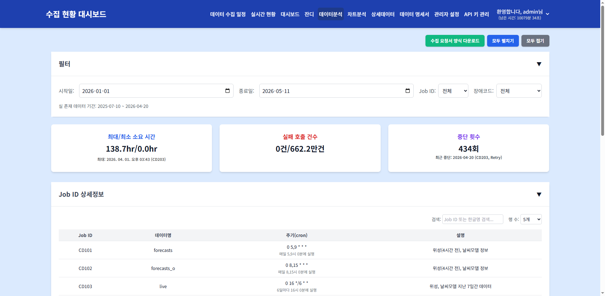

# 데이터 분석

> **핵심 기능**: 수집 데이터의 소요 시간, 성공률, 연속 실패 등 다양한 지표를 분석하여 데이터 품질과 수집 안정성을 평가합니다.

---

## 1. 메뉴 접속 방법

- **경로**: 상단 메뉴 → 데이터 분석
- **URL**: `/data_analysis`
- **필요 권한**: `analysis`
- **로그**: 메뉴 접근 시 `tb_user_acs_log` 테이블에 접근 이력이 기록됩니다.

---

## 2. 화면 구성

### 2.1 전체 화면 구조



### 2.2 각 영역 상세 설명

#### ① 필터 카드 (`#filter-card`)

| 요소 | ID | 설명 |
|------|-----|------|
| 시작일 | `#startDate` | 조회 시작 날짜 |
| 종료일 | `#endDate` | 조회 종료 날짜 |
| Job ID | `#jobIdSelect` | 특정 Job ID 필터 (기본: 전체) |
| 장애코드 | `#errorCodeSelect` | 특정 장애 코드 필터 (기본: 전체) |
| 실 존재 데이터 기간 | `#data-min-date` ~ `#data-max-date` | DB에 실제로 존재하는 데이터의 최소/최대 날짜 |

**동작 로직:**
- 페이지 진입 시 자동으로 올해 1월 1일 ~ 오늘(KST 기준)로 설정됩니다.
- 필터 변경 시 상단 요약 카드와 하단 테이블이 자동으로 갱신됩니다.
- Job ID와 장애코드 드롭다운은 `tb_con_mst` 및 `tb_sts_cd_mst`에서 동적으로 로드됩니다.

#### ② 요약 카드 (3개)

| 카드 | ID | 내용 | 색상 |
|------|-----|------|------|
| 최대/최소 소요 시간 | `#durationRangeCard` | 선택 기간 내 수집 소요 시간의 최대/최소값 | 파란색 |
| 실패 호출 건수 | `#failCountCard` | 상태 코드가 CD902(장애)인 건수 | 빨간색 |
| 중단 횟수 | `#stopCountCard` | 수집이 중단된 건수 | 볼색 |

**계산 로직:**
- 최대/최소 소요 시간: `MAX(end_dt - start_dt)`, `MIN(end_dt - start_dt)`
- 실패 호출 건수: `COUNT(*) WHERE status = 'CD902'`
- 중단 횟수: `COUNT(*) WHERE status IN ('CD903', 'CD905')` (미수집, 중단)

#### ③ Job ID 상세정보 카드 (`#job-info-card`)

| 기능 | 설명 |
|------|------|
| 검색 | `#jobInfoSearch` - Job ID 또는 한글명으로 실시간 필터링 |
| 행 수 | `#jobInfoPageSize` - 5/10/20/50/100개 선택 |
| 테이블 | `#jobInfoTable` - Job ID, 데이터명, 주기(cron), 설명 |
| 페이징 | `#jobInfoPagination` - 페이지 이동 버튼 |

**데이터 출처:**
- `tb_con_mst` - Job 기본 정보
- `tb_mngr_sett` - 추가 설정 정보 (있는 경우)

#### ④ 수집 및 가공 데이터 카드 (`#raw-data-card`)

| 컬럼 | 데이터 | 설명 |
|------|--------|------|
| 날짜 | `start_dt` | 수집 시작 날짜 (KST) |
| Job ID | `job_id` | 수집 작업 ID |
| 장애코드 | `status` | 상태 코드 (CD901~CD904 등) |
| 요일 | `DAYOFWEEK(start_dt)` | 일~토 요일 표시 |
| 수집시간(hr) | `end_dt - start_dt` | 실제 소요 시간 (시간 단위) |
| 예측 수집시간(hr) | `predicted_duration` | ML 또는 통계 기반 예측 소요 시간 |
| 완전성(%) | `completeness` | (실제 수집 건수 / 예상 건수) × 100 |
| 평균소요시간(hr) | `avg_duration` | 전체 기간 평균 소요 시간 |
| 최대/최소 제외 평균(hr) | `trimmed_avg` | 최대/최소값 제외 평균 |
| 최근3회평균(hr) | `recent_3avg` | 최근 3회 실행의 평균 소요 시간 |
| 연속실패 | `fail_streak` | 현재까지 연속 실패 횟수 |
| 이상치 | `is_outlier` | 평균 대비 2표준편차 이상 여부 |
| 성공률변화(%) | `success_rate_change` | 전 기간 대비 성공률 변화량 |
| 누적수집 | `cumulative_count` | 해당 Job의 누적 수집 건수 |

**검색 및 필터링:**
- **검색 (`#rawDataSearch`)**: Job ID 또는 장애코드로 실시간 필터링
- **행 수 (`#rawDataPageSize`)**: 10/20/50/100개 선택
- **페이징 (`#rawPagination`)**: 페이지 이동

**데이터 출처:**
- API: `GET /api/data_analysis` (또는 `/api/analysis/data`)
- Service: `AnalysisService.get_dynamic_chart_data()` 또는 별도 분석 메소드
- Mapper: `AnalysisMapper`
- SQL: `sql/analytics/analytics_sql.py`

---

## 3. 데이터 흐름 및 처리 로직

### 3.1 전체 데이터 흐름도

```
[사용자] → [data_analysis.html] → [data_analysis.js]
                                            ↓
                        [fetch('/api/data_analysis')]
                                            ↓
                        [analysis_routes.py]
                                            ↓
                        [AnalysisService]
                                            ↓
        ┌───────────────────────────────────┼───────────────────────────────────┐
        ↓                                   ↓                                   ↓
[AnalysisMapper]              [UserMapper]                    [MstMapper]
        ↓                                   ↓                                   ↓
[sql/analytics/analytics_sql.py]  [data_permissions 조회]         [Job ID 목록]
        ↓                                   ↓                                   ↓
[TB_CON_HIST] 집계            [TB_USER_DATA_PERM_AUTH_CTRL]    [TB_CON_MST]
        └───────────────────────────────────┼───────────────────────────────────┘
                                            ↓
                         [JSON 응답] → [테이블 렌더링]
```

### 3.2 주요 지표 계산 로직

**소요 시간 (Duration):**
```
수집시간(hr) = (end_dt - start_dt)의 시간 단위 변환
```

**완전성 (Completeness):**
```
완전성(%) = (실제 수집 건수 / 예상 수집 건수) × 100
```

**최대/최소 제외 평균 (Trimmed Average):**
```
값이 3개 이상: (전체 합계 - 최대값 - 최소값) / (개수 - 2)
값이 2개 이하: 일반 평균
```

**최근 3회 평균 (Recent 3 Average):**
```
최근 3회 실행의 소요 시간 산술평균
```

**연속 실패 (Fail Streak):**
```
현재까지 연속된 CD902(장애) 또는 CD903(미수집) 횟수
```

**이상치 (Outlier):**
```
|현재값 - 평균값| > 2 × 표준편차 → 이상치(True)
```

**성공률 변화:**
```
성공률변화(%) = (현재 기간 성공률 - 이전 기간 성공률)
```

---

## 4. 조작 방법

### 4.1 필터 변경하여 조회

**조작 절차:**
1. `시작일` / `종료일` 입력 필드에서 날짜 선택
2. `Job ID` 또는 `장애코드` 드롭다운에서 선택 (선택 사항)
3. 상단 요약 카드와 하단 테이블이 자동 갱신됨

**확인 방법:**
- 요약 카드의 숫자가 변경되는지 확인
- 테이블 데이터가 갱신되는지 확인

### 4.2 Job ID 상세정보 조회

**조작 절차:**
1. `Job ID 상세정보` 카드 펼치기 (헤더 클릭)
2. 검색어 입력 또는 행 수 변경
3. 페이지네이션으로 추가 항목 확인

### 4.3 수집 데이터 테이블 조회

**조작 절차:**
1. `수집 및 가공 데이터` 카드 펼치기
2. 검색어 입력 (Job ID 또는 장애코드)
3. 행 수 변경 (10/20/50/100개)
4. 페이지네이션으로 이동

**확인 방법:**
- 총 건수 표시 (`총 1,234건`)
- 각 컬럼 값이 정상적으로 표시되는지 확인
- 이상치 표시 여부 확인

---

## 5. 모니터링 체크리스트

- [ ] **최대/최소 소요 시간**이 예상 범위 내인지 확인
- [ ] **실패 호출 건수**가 급증하지 않는지 확인
- [ ] **중단 횟수**가 0에 가까운지 확인
- [ ] **연속 실패**가 3회 이상인 Job이 있는지 확인
- [ ] **이상치**가 발생한 Job이 있는지 확인
- [ ] **성공률 변화**가 큰 폭으로 하락한 Job이 있는지 확인
- [ ] **완전성**이 100%에 가까운지 확인

---

## 6. 자주 발생하는 문제

| 증상 | 원인 | 해결 방법 |
|------|------|-----------|
| 테이블이 비어있음 | 날짜 범위 내 데이터 없음 | 날짜 범위 확대 또는 필터 초기화 |
| 소요 시간이 0으로 표시됨 | `end_dt`가 `start_dt`와 동일 | 데이터 품질 문제, `tb_con_hist` 확인 |
| 이상치가 너무 많음 | 데이터 품질 저하 또는 기준값 부적절 | 관리자 설정에서 이상치 임계값 조정 |
| 예측 수집시간이 부정확함 | 예측 모델 미학습 또는 데이터 부족 | 충분한 학습 데이터 확보 후 모델 재학습 |
| 완전성이 낮음 | 데이터 유실 또는 수집 누락 | 수집 에이전트 로그 확인 |
| 특정 Job이 보이지 않음 | 사용자 데이터 권한 없음 | 관리자에게 데이터 접근 권한 요청 |

---

## 7. 관련 DB 테이블 및 쿼리

### 7.1 주요 테이블

| 테이블 | 설명 |
|--------|------|
| `tb_con_hist` | 수집 실행 이력 (소요 시간, 상태, 시간) |
| `tb_con_mst` | 수집 작업 마스터 (Job ID, 데이터명, 주기) |
| `tb_sts_cd_mst` | 상태 코드 마스터 (CD901~CD904 정의) |
| `tb_user_data_perm_auth_ctrl` | 사용자별 데이터 접근 권한 |

### 7.2 데이터 분석 조회 API

```
GET /api/data_analysis?start_date=2025-01-01&end_date=2025-12-31&job_id=CD101&error_code=CD902
```

**응답 구조:**
```json
[
  {
    "date": "2025-01-15",
    "job_id": "CD101",
    "status": "CD901",
    "day_of_week": "월",
    "duration": 2.5,
    "predicted_duration": 2.3,
    "completeness": 98.5,
    "avg_duration": 2.4,
    "trimmed_avg": 2.35,
    "recent_3avg": 2.45,
    "fail_streak": 0,
    "is_outlier": false,
    "success_rate_change": 0.5,
    "cumulative_count": 1250
  }
]
```

---

> 다음 문서: [05-data-spec.md](05-data-spec.md)
