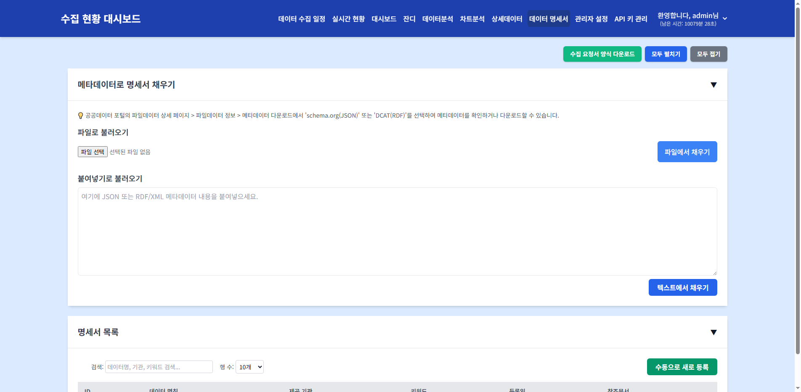
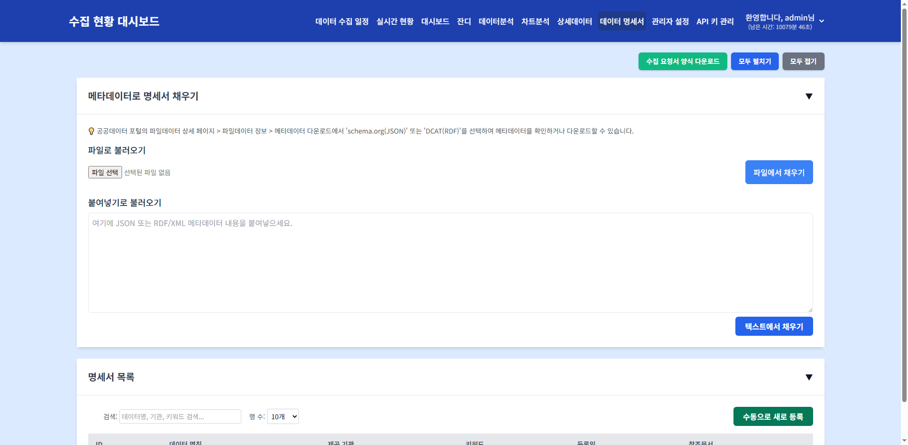

# 데이터 명세서

> **핵심 기능**: 수집 대상 데이터의 명세서를 등록, 조회, 수정, 삭제하고, 메타데이터를 자동으로 채워 넣어 데이터 관리의 효율성을 높입니다.

---

## 1. 메뉴 접속 방법

- **경로**: 상단 메뉴 → 데이터 명세서
- **URL**: `/data_spec`
- **필요 권한**: `data_spec`
- **로그**: 메뉴 접근 시 `tb_user_acs_log` 테이블에 접근 이력이 기록됩니다.

---

## 2. 화면 구성

### 2.1 전체 화면 구조



### 2.2 각 영역 상세 설명

#### ① 메타데이터로 명세서 채우기 카드 (`#metadata-import-card`)

**지원 형식:**
| 형식 | 파일 확장자 | 설명 |
|------|------------|------|
| schema.org(JSON) | `.json` | 공공데이터 포털 메타데이터 JSON |
| DCAT(RDF) | `.xml`, `.rdf` | DCAT 표준 RDF/XML 메타데이터 |

**입력 방법:**
| 방법 | 요소 | 설명 |
|------|------|------|
| 파일로 불러오기 | `#metadata-file-input` | 파일 선택 후 `파일에서 채우기` 버튼 클릭 |
| 붙여넣기로 불러오기 | `#metadata-text-input` | 텍스트 직접 입력 후 `텍스트에서 채우기` 버튼 클릭 |

**동작 로직:**
- 파일 또는 텍스트 입력 후 버튼 클릭
- `data_spec.js`의 파서가 JSON/XML을 파싱
- 파싱된 데이터로 명세서 등록 모달의 폼 필드 자동 채움
- API URL, 데이터 명칭, 제공 기관, 키워드 등 추출

#### ② 명세서 목록 카드 (`#spec-list-card`)

| 기능 | 요소 | 설명 |
|------|------|------|
| 총 건수 | `#spec-total-count` | 전체 명세서 개수 표시 |
| 검색 | `#specSearch` | 데이터명, 기관, 키워드로 실시간 필터링 |
| 행 수 | `#specPageSize` | 10/20/50/100개 선택 |
| 새로 등록 | `#add-new-btn` | 빈 명세서 등록 모달 열기 |
| 테이블 | `#spec-list-body` | 명세서 목록 테이블 |
| 페이징 | `#specPagination` | 페이지 이동 버튼 |

**테이블 컬럼:**
| 컬럼 | 데이터 | 설명 |
|------|--------|------|
| ID | `id` | 명세서 고유 ID |
| 데이터 명칭 | `data_name` | 데이터의 한글 이름 |
| 제공 기관 | `provider` | 데이터 제공 기관명 |
| 키워드 | `keywords` | 검색용 키워드 (쉼표 구분) |
| 등록일 | `created_at` | 명세서 최초 등록일 |
| 참조문서 | `reference_doc_url` | 참고 문서 링크 (있는 경우 아이콘 표시) |

**동작 로직:**
- 행 클릭 시 `#spec-modal` 모달 열림 (상세 조회/수정)
- 검색 입력 시 실시간 필터링
- 페이지네이션으로 대량 데이터 처리

#### ③ 명세서 상세/등록 모달 (`#spec-modal`)

**기본 정보:**
| 필드 | ID | 설명 | 필수 |
|------|-----|------|------|
| 데이터 명칭 | `#data_name` | 데이터의 한글 이름 | ✅ |
| 제공 기관 | `#provider` | 데이터 제공 기관명 | - |
| API URL | `#api_url` | 데이터 수집 API 엔드포인트 | - |
| 참고 문서 URL | `#reference_doc_url` | 참고 문서 링크 | - |
| 비밀번호 | `#password` | 수정/삭제 시 필요한 비밀번호 | ✅ (신규) |
| 키워드 | `#keywords` | 검색용 키워드 | - |
| 상세 설명 | `#description` | 데이터에 대한 상세 설명 | - |

**동적 섹션:**
| 섹션 | 컨테이너 | 설명 |
|------|----------|------|
| 요청 파라미터 | `#request-params-container` | API 호출 시 필요한 파라미터 목록 |
| 응답 파라미터 | `#response-params-container` | API 응답의 파라미터 목록 |

**동작 로직:**
- `저장 후 닫기` 클릭 시 `#save-password-confirm-modal` 열림 (신규 또는 비밀번호 미설정 시)
- `삭제` 클릭 시 `#password-confirm-modal` 열림
- 비밀번호는 4자리 이상 입력 필요
- API URL 입력 후 자동 분석 기능으로 요청/응답 파라미터 추출 가능

#### ④ URL 분석 결과 모달 (`#url-analysis-modal`)

**표시 조건:** API URL 입력 후 자동 분석 또는 수동 분석 버튼 클릭
**표시 내용:**
- URL 유효성 검사 결과
- 요청 파라미터 자동 추출 (query string, path variable)
- 응답 파라미터 자동 추출 (JSON 응답 샘플 기반)
- 데이터 매핑 테이블

**동작:**
- `선택한 정보로 명세서 채우기` 버튼 클릭 시 모달 닫히고 폼 필드 업데이트

---

## 3. 데이터 흐름 및 처리 로직

### 3.1 전체 데이터 흐름도

```
[사용자] → [data_spec.html] → [data_spec.js]
                                    ↓
                    ┌───────────────┼───────────────┐
                    ↓               ↓               ↓
            [메타데이터 파싱]  [명세서 CRUD]    [URL 분석]
                    ↓               ↓               ↓
            [JSON/XML 파서]   [API 호출]      [HTTP 요청]
                    ↓               ↓               ↓
            [폼 필드 채움]    [DB 저장/조회]   [응답 파싱]
                    ↓               ↓               ↓
            [모달 표시]       [목록 갱신]     [파라미터 추출]
```

### 3.2 명세서 저장 절차

**신규 등록:**
1. `수동으로 새로 등록` 또는 메타데이터 채우기
2. 모달 폼에 데이터 입력
3. `저장 후 닫기` 클릭
4. 비밀번호 설정 모달 표시 (4자리 이상)
5. `POST /api/data_spec` API 호출
6. 목록 자동 갱신

**수정:**
1. 목록에서 대상 행 클릭
2. 모달 폼에서 데이터 수정
3. `저장 후 닫기` 클릭
4. `PUT /api/data_spec/{id}` API 호출

**삭제:**
1. 목록에서 대상 행 클릭
2. `삭제` 버튼 클릭
3. 비밀번호 확인 모달 표시
4. 비밀번호 입력 후 `확인`
5. `DELETE /api/data_spec/{id}` API 호출
6. 목록 자동 갱신

### 3.3 메타데이터 파싱 로직

**schema.org(JSON):**
```json
{
  "@context": "https://schema.org",
  "@type": "Dataset",
  "name": "데이터 명칭",
  "publisher": {"name": "제공 기관"},
  "keyword": ["키워드1", "키워드2"],
  "distribution": {"contentUrl": "API URL"}
}
```

**DCAT(RDF/XML):**
```xml
<dcat:Dataset>
  <dct:title>데이터 명칭</dct:title>
  <dct:publisher>제공 기관</dct:publisher>
  <dcat:keyword>키워드1</dcat:keyword>
  <dcat:distribution rdf:resource="API URL"/>
</dcat:Dataset>
```

---

## 4. 조작 방법

### 4.1 메타데이터로 명세서 자동 채우기

**조작 절차 (파일):**
1. `메타데이터로 명세서 채우기` 카드 펼치기
2. `파일로 불러오기` 영역에서 파일 선택 (`.json`, `.xml`, `.rdf`)
3. `파일에서 채우기` 버튼 클릭
4. 명세서 등록 모달이 열리며 필드가 자동으로 채워짐

**조작 절차 (붙여넣기):**
1. `메타데이터로 명세서 채우기` 카드 펼치기
2. `붙여넣기로 불러오기` 텍스트 영역에 메타데이터 내용 입력
3. `텍스트에서 채우기` 버튼 클릭

**확인 방법:**
- 모달의 데이터 명칭, 제공 기관, API URL 등이 채워졌는지 확인

### 4.2 명세서 직접 등록



**조작 절차:**
1. `명세서 목록` 카드에서 `수동으로 새로 등록` 버튼 클릭
2. 모달 폼에 데이터 입력
3. `저장 후 닫기` 클릭
4. 비밀번호 설정 (4자리 이상)
5. `저장` 클릭

**확인 방법:**
- 목록에 신규 항목이 추가되었는지 확인
- 총 건수가 1 증가했는지 확인

### 4.3 명세서 조회 및 수정

**조작 절차:**
1. 목록에서 대상 행 클릭
2. 모달에서 내용 확인
3. 필요 시 필드 수정
4. `저장 후 닫기` 클릭

**확인 방법:**
- 목록의 해당 행 내용이 변경되었는지 확인

### 4.4 명세서 삭제

**조작 절차:**
1. 목록에서 대상 행 클릭
2. 모달 하단의 `삭제` 버튼 클릭
3. 비밀번호 확인 모달에서 등록 시 설정한 비밀번호 입력
4. `확인` 클릭

**확인 방법:**
- 목록에서 해당 행이 사라졌는지 확인
- 총 건수가 1 감소했는지 확인

---

## 5. 모니터링 체크리스트

- [ ] **명세서 총 건수**가 증가하는지 확인 (신규 데이터 수집 시)
- [ ] **API URL**이 유효한지 확인 (404 오류 여부)
- [ ] **참고 문서 URL**이 정상적으로 연결되는지 확인
- [ ] **키워드**가 적절히 등록되어 검색이 용이한지 확인
- [ ] **비밀번호**가 분실되지 않도록 별도 관리
- [ ] **메타데이터 자동 채우기** 실패 시 수동으로 입력 가능한지 확인

---

## 6. 자주 발생하는 문제

| 증상 | 원인 | 해결 방법 |
|------|------|-----------|
| 메타데이터 파싱 실패 | 지원하지 않는 형식 또는 잘못된 데이터 | schema.org 또는 DCAT 표준 형식 확인 |
| API URL이 유효하지 않음 | 잘못된 URL 또는 서비스 종료 | 브라우저에서 URL 직접 접속 테스트 |
| 저장 실패 | 필수 항목(데이터 명칭) 누락 | 데이터 명칭 입력 확인 |
| 삭제 실패 | 비밀번호 불일치 | 등록 시 설정한 비밀번호 확인 |
| 목록이 비어있음 | 등록된 명세서 없음 | 메타데이터 자동 채우기 또는 수동 등록 |
| 검색 결과 없음 | 검색어와 일치하는 항목 없음 | 검색어 변경 또는 키워드 확인 |
| URL 분석 실패 | CORS 오류 또는 서버 응답 없음 | 브라우저 개발자 도구에서 네트워크 오류 확인 |

---

## 7. 관련 DB 테이블 및 쿼리

### 7.1 주요 테이블

| 테이블 | 설명 |
|--------|------|
| `tb_data_spec` | 데이터 명세서 기본 정보 (ID, 데이터명, 제공기관, API URL 등) |
| `tb_data_spec_parm` | 명세서 파라미터 정보 (요청/응답 파라미터명, 타입, 설명) |
| `tb_user_acs_log` | 메뉴 접근 이력 |

### 7.2 명세서 API

```
GET    /api/data_spec              # 명세서 목록 조회
POST   /api/data_spec              # 명세서 신규 등록
GET    /api/data_spec/{id}         # 명세서 상세 조회
PUT    /api/data_spec/{id}         # 명세서 수정
DELETE /api/data_spec/{id}         # 명세서 삭제 (비밀번호 필요)
POST   /api/data_spec/parse        # 메타데이터 파싱
POST   /api/data_spec/analyze-url  # URL 분석
```

---

> 다음 문서: [06-card-summary.md](06-card-summary.md)
