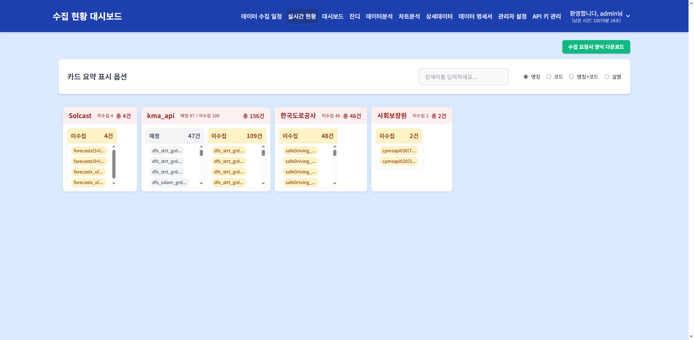

# 카드 요약

> **핵심 기능**: 수집 작업의 핵심 지표를 카드 형태로 요약하여 한눈에 현황을 파악하고, 표/카드 뷰 전환 및 다양한 표시 옵션을 제공합니다.

---

## 1. 메뉴 접속 방법

- **경로**: 상단 메뉴 → 카드 요약
- **URL**: `/card_summary`
- **필요 권한**: `card_summary`
- **로그**: 메뉴 접근 시 `tb_user_acs_log` 테이블에 접근 이력이 기록됩니다.

---

## 2. 화면 구성

### 2.1 전체 화면 구조



### 2.2 각 영역 상세 설명

#### ① 수집 요청서 양식 다운로드 버튼

| 요소 | 설명 |
|------|------|
| 버튼 | 우측 상단 `수집 요청서 양식 다운로드` |
| 기능 | Excel 파일(.xlsx) 다운로드 |
| 스타일 | 녹색 배경(#10b981), 흰색 글자 |

#### ② 카드 요약 표시 옵션 (`#cardContainer` 상단)

| 기능 | 요소 | 설명 |
|------|------|------|
| 뷰 모드 토글 | `#viewModeToggle` | 표(테이블) ↔ 콩(카드) 뷰 전환 |
| 검색 | `#cardSearchInput` | Job ID, 데이터명, 상태 등으로 실시간 필터링 |
| 표시 모드 | `#display-mode-selector` | 명칭 / 코드 / 명칭+코드 / 설명 중 선택 |

**표시 모드 상세:**
| 모드 | 값 | 표시 내용 |
|------|-----|----------|
| 명칭 | `name` | Job의 한글 이름 (`cd_nm`)만 표시 |
| 코드 | `code` | Job ID (예: CD101)만 표시 |
| 명칭+코드 | `both` | `코드: 명칭` 형태로 표시 (예: CD101: 기상청예보) |
| 설명 | `desc` | Job 상세 설명 표시 |

#### ③ 카드 컨테이너 (`#cardContainer`)

**카드 구조:**
```
┌──────────────────┐
│ [CD101]          │  ← Job ID (표시 모드에 따라 코드/명칭/둘 다)
│ 기상청 예보 데이터 │  ← 데이터명
│                  │
│ 성공률: 95.5%    │  ← 기간별 성공률
│ 연속실패: 0회    │  ← 연속 실패 횟수
│ 상태: 정상       │  ← 상태 (정상/경고/위험)
│                  │
│ [상세 보기]      │  ← 상세 정보 링크 (있는 경우)
└──────────────────┘
```

**카드 상태별 스타일:**
| 상태 | 조건 | 색상 |
|------|------|------|
| 정상 | 성공률 ≥ 임계값, 연속실패 < 경고 임계값 | 녹색 계열 |
| 경고 | 성공률 < 임계값 또는 연속실패 ≥ 경고 임계값 | 노란색/주황색 계열 |
| 위험 | 연속실패 ≥ 위험 임계값 | 빨간색 계열 |

**데이터 출처:**
- API: `GET /api/card_summary`
- Service: `CardSummaryService.get_summary()`
- Mapper: `CardSummaryMapper`
- SQL: `sql/card_summary/card_summary_sql.py`

---

## 3. 데이터 흐름 및 처리 로직

### 3.1 전체 데이터 흐름도

```
[사용자] → [card_summary.html] → [card_summary.js]
                                            ↓
                        [fetch('/api/card_summary')]
                                            ↓
                        [card_summary_routes.py]
                                            ↓
                        [CardSummaryService.get_summary()]
                                            ↓
        ┌───────────────────────────────────┼───────────────────────────────────┐
        ↓                                   ↓                                   ↓
[CardSummaryMapper]            [UserMapper]                    [MngrSettMapper]
        ↓                                   ↓                                   ↓
[sql/card_summary/*.sql]       [data_permissions 조회]         [설정 정보]
        ↓                                   ↓                                   ↓
[TB_CON_HIST] 집계            [TB_USER_DATA_PERM_AUTH_CTRL]    [TB_MNGR_SETT]
        └───────────────────────────────────┼───────────────────────────────────┘
                                            ↓
                         [JSON 응답] → [카드 렌더링]
```

### 3.2 주요 지표 계산

**성공률:**
```
성공률 = (성공 건수 / (성공 건수 + 실패 건수 + 미수집 건수)) × 100
```

**연속 실패:**
```
최근 10회 실행 중 CD902(장애) 또는 CD903(미수집) 상태인 횟수
```

**상태 결정:**
- `tb_mngr_sett`의 임계값 기준
- 성공률 임계값 미만 또는 연속 실패 경고 임계값 이상 → 경고
- 연속 실패 위험 임계값 이상 → 위험

---

## 4. 조작 방법

### 4.1 뷰 모드 전환

**조작 절차:**
1. `표` 또는 `콩` 토글 클릭

**확인 방법:**
- 카드 형태 ↔ 테이블 형태로 전환됨
- 카드: 직사각형 카드 그리드 배치
- 표: 행/열 테이블 배치

### 4.2 검색

**조작 절차:**
1. 검색 입력 필드에 텍스트 입력

**확인 방법:**
- 입력 즉시 카드/행이 필터링됨
- Job ID, 데이터명, 상태 등 모든 텍스트 필드 검색

### 4.3 표시 모드 변경

**조작 절차:**
1. 라디오 버튼 그룹에서 `명칭` / `코드` / `명칭+코드` / `설명` 선택

**확인 방법:**
- 카드/표의 제목 영역이 변경됨
- 예: "CD101" → "기상청예보" → "CD101: 기상청예보"

---

## 5. 모니터링 체크리스트

- [ ] **위험 상태 카드**(빨간색)가 있는지 확인
- [ ] **경고 상태 카드**(노란색)가 과도하게 많지 않은지 확인
- [ ] **성공률**이 전반적으로 90% 이상인지 확인
- [ ] **연속 실패**가 3회 이상인 Job이 있는지 확인
- [ ] **검색**으로 특정 Job을 쉽게 찾을 수 있는지 확인

---

## 6. 자주 발생하는 문제

| 증상 | 원인 | 해결 방법 |
|------|------|-----------|
| 카드가 비어있음 | 데이터 수집 기록 없음 | 날짜 범위 확대 또는 데이터 수집 에이전트 상태 확인 |
| 특정 Job이 보이지 않음 | 사용자 데이터 권한 없음 | 관리자에게 데이터 접근 권한 요청 |
| 성공률이 0%로 표시됨 | 해당 기간 내 수집 이력 없음 | 데이터 수집 스케줄/에이전트 상태 확인 |
| 상태가 모두 위험으로 표시됨 | 임계값 설정 부적절 | 관리자 설정에서 성공률/연속실패 임계값 조정 |
| 검색 결과 없음 | 검색어와 일치하는 Job 없음 | 검색어 변경 또는 전체 목록 확인 |

---

## 7. 관련 DB 테이블 및 쿼리

### 7.1 주요 테이블

| 테이블 | 설명 |
|--------|------|
| `tb_con_hist` | 수집 실행 이력 (성공/실패 상태, 시간) |
| `tb_con_mst` | 수집 작업 마스터 (Job ID, 데이터명) |
| `tb_mngr_sett` | 관리자 설정 (성공률 임계값, 연속실패 임계값) |
| `tb_user_data_perm_auth_ctrl` | 사용자별 데이터 접근 권한 |

### 7.2 카드 요약 조회 API

```
GET /api/card_summary
```

**응답 구조:**
```json
[
  {
    "job_id": "CD101",
    "cd_nm": "기상청예보",
    "success_rate": 95.5,
    "fail_streak": 0,
    "status": "normal",
    "color": "#28a745"
  }
]
```

---

> 다음 문서: [07-mapping.md](07-mapping.md)
