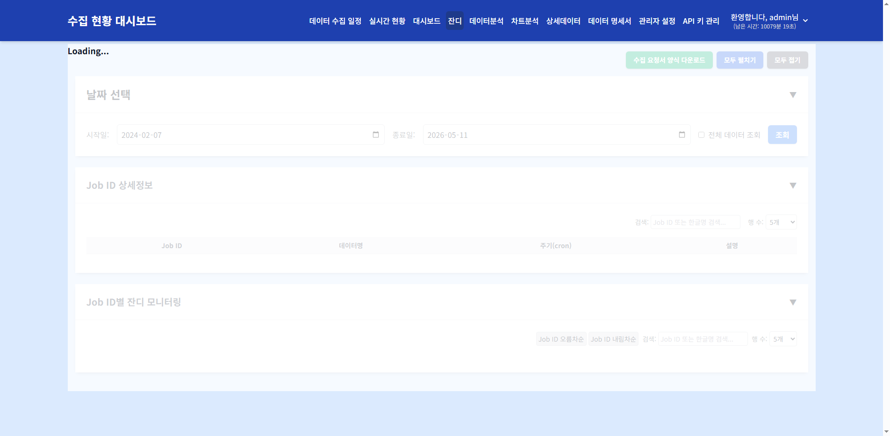

# 잔디 모니터링

> **핵심 기능**: 각 Job ID별 수집 활동을 GitHub 잔디(Contribution Graph) 형태의 히트맵으로 시각화하여, 데이터 수집 패턴과 이상 징후를 한눈에 파악합니다.

---

## 1. 메뉴 접속 방법

- **경로**: 상단 메뉴 → 잔디
- **URL**: `/jandi`
- **필요 권한**: `jandi`
- **로그**: 메뉴 접근 시 `tb_user_acs_log` 테이블에 접근 이력이 기록됩니다.

---

## 2. 화면 구성

### 2.1 전체 화면 구조



### 2.2 각 영역 상세 설명

#### ① 날짜 선택 카드 (`#date-selection-card-jandi`)

| 요소 | ID | 설명 |
|------|-----|------|
| 시작일 | `#start-date` | 조회 시작 날짜 |
| 종료일 | `#end-date` | 조회 종료 날짜 |
| 전체 데이터 조회 | `#allDataCheckbox` | 체크 시 전체 기간 조회 |
| 조회 버튼 | `#filter-button` | 데이터 갱신 |

#### ② Job ID 상세정보 카드 (`#job-info-card-jandi`)

- 데이터 분석 메뉴얼의 Job ID 상세정보와 동일한 구조
- `tb_con_mst`의 Job 기본 정보 표시

#### ③ Job ID별 잔디 모니터링 카드 (`#jandi-monitoring-card`)

**정렬 기능:**
| 버튼 | ID | 설명 |
|------|-----|------|
| Job ID 오름차순 | `#sortAsc` | Job ID A→Z 정렬 |
| Job ID 내림차순 | `#sortDesc` | Job ID Z→A 정렬 |

**검색 및 페이징:**
| 기능 | ID | 설명 |
|------|-----|------|
| 검색 | `#jandiSearch` | Job ID 또는 한글명 필터링 |
| 행 수 | `#jandiPageSize` | 5/10/15/20개 선택 |
| 페이징 | `#jandiPagination` | 페이지 이동 |

**히트맵 (`#heatmap-container`):**
- 각 Job ID별로 가로로 펼쳐진 캘린더 히트맵
- X축: 날짜 (월 단위 표시)
- Y축: 요일 (생략 가능)
- 색상 밀도: 해당 날짜의 수집 성공률 또는 수집 횟수
  - 진한 녹색: 높은 성공률/많은 수집
  - 연한 녹색/회색: 낮은 성공률/적은 수집
  - 흰색/비어있음: 수집 없음

**데이터 출처:**
- API: `GET /api/jandi`
- Service: `JandiService`
- Mapper: `JandiMapper`
- SQL: `sql/jandi/jandi_sql.py`
- 테이블: `tb_con_hist`

---

## 3. 데이터 흐름 및 처리 로직

### 3.1 전체 데이터 흐름도

```
[사용자] → [jandi.html] → [jandi.js]
                                  ↓
              [fetch('/api/jandi')]
                                  ↓
              [jandi_routes.py]
                                  ↓
              [JandiService]
                                  ↓
              [JandiMapper]
                                  ↓
              [sql/jandi/jandi_sql.py]
                                  ↓
              [TB_CON_HIST]
                                  ↓
              [JSON 응답] → [SVG 히트맵 렌더링]
```

### 3.2 히트맵 데이터 집계

```
집계 단위: 일별 (date)
집계 대상: job_id별
집계 값: 
  - 성공률 = (성공 건수 / 전체 건수) × 100
  - 또는 수집 횟수 (count)

응답 구조:
[
  {
    "job_id": "CD101",
    "cd_nm": "기상청예보",
    "data": [
      {"date": "2025-01-01", "value": 95},
      {"date": "2025-01-02", "value": 100},
      ...
    ]
  }
]
```

### 3.3 색상 스케일

| 색상 | 조건 |
|------|------|
| 진한 녹색 | 성공률 ≥ 90% 또는 수집 횟수 ≥ 상위 25% |
| 중간 녹색 | 성공률 70~89% 또는 수집 횟수 중간 |
| 연한 녹색 | 성공률 50~69% 또는 수집 횟수 하위 |
| 연한 회색 | 성공률 1~49% 또는 수집 횟수 매우 적음 |
| 흰색/없음 | 수집 없음 (0%) |

---

## 4. 조작 방법

### 4.1 날짜 범위 변경

**조작 절차:**
1. 시작일/종료일 선택
2. `조회` 버튼 클릭

**확인 방법:**
- 히트맵의 날짜 범위가 변경됨

### 4.2 Job ID 정렬

**조작 절차:**
1. `Job ID 오름차순` 또는 `Job ID 내림차순` 버튼 클릭

**확인 방법:**
- 히트맵 카드의 순서가 변경됨

### 4.3 히트맵 해석

**조작 절차:**
1. 히트맵의 특정 셀에 마우스 오버
2. 툴팁으로 해당 날짜의 상세 정보 확인

**확인 내용:**
- 날짜
- 수집 성공률 (%)
- 수집 횟수
- 상태 (성공/실패/미수집)

---

## 5. 모니터링 체크리스트

- [ ] **히트맵에 흰색(비어있는) 구간**이 없는지 확인 (연속 미수집 여부)
- [ ] **특정 Job**의 색상이 전반적으로 연한지 확인 (지속적 낮은 성공률)
- [ ] **주기적 패턴**이 이상한지 확인 (예: 특정 요일마다 실패)
- [ ] **최근 날짜**의 색상이 정상인지 확인

---

## 6. 자주 발생하는 문제

| 증상 | 원인 | 해결 방법 |
|------|------|-----------|
| 히트맵이 비어있음 | 날짜 범위 내 데이터 없음 | 날짜 범위 확대 |
| 특정 Job이 보이지 않음 | 사용자 데이터 권한 없음 | 관리자에게 데이터 접근 권한 요청 |
| 히트맵 색상이 모두 연함 | 해당 기간 내 지속적인 낮은 성공률 | 수집 에이전트 상태 확인 |
| 히트맵에 줄무늬 패턴 | 주기적 실패 (예: 주말) | 스케줄 설정 확인 |
| 툴팁이 표시되지 않음 | 해당 날짜에 데이터 없음 | 다른 날짜 확인 |

---

## 7. 관련 DB 테이블 및 쿼리

### 7.1 주요 테이블

| 테이블 | 설명 |
|--------|------|
| `tb_con_hist` | 수집 실행 이력 (날짜, 성공/실패 상태) |
| `tb_con_mst` | 수집 작업 마스터 (Job ID, 데이터명) |
| `tb_user_data_perm_auth_ctrl` | 사용자별 데이터 접근 권한 |

### 7.2 잔디 조회 API

```
GET /api/jandi?start_date=2025-01-01&end_date=2025-12-31
```

**응답 구조:**
```json
[
  {
    "job_id": "CD101",
    "cd_nm": "기상청예보",
    "data": [
      {"date": "2025-01-01", "success_rate": 95, "count": 10},
      {"date": "2025-01-02", "success_rate": 100, "count": 12}
    ]
  }
]
```

---

> 다음 문서: [10-raw-data.md](10-raw-data.md)
