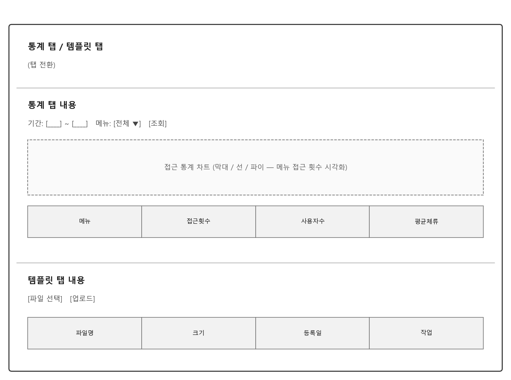

# 관리자 (통계/템플릿)

> **기준 버전 / 최종 확인일**: v1.1.0 · 2026-07-22

> **핵심 기능**: 시스템 사용 현황 통계를 조회하고, 엑셀 템플릿 파일을 관리합니다.

---

## 메뉴 접속 방법

- **경로**: 상단 메뉴 → 관리자
- **URL**: `/admin`
- **필요 권한**: `admin`
- **로그**: 메뉴 접근 시 `tb_user_acs_log` 테이블에 접근 이력이 기록됩니다.

---

## 화면 구성

### 전체 화면 구조

> 📷 *화면 캡처 미보유 — 운영 환경에서 재캡처 필요. 아래는 구조 파악용 와이어프레임(실제 화면 배치와 세부 스타일은 다를 수 있음).*

### 각 영역 상세 설명

#### ① 통계 탭

**필터:**
| 요소 | 설명 |
|------|------|
| 기간 | 조회 시작일/종료일 |
| 메뉴 | 특정 메뉴 필터 (전체/대시보드/수집스케줄 등) |
| 조회 | 데이터 갱신 |

**차트:**
- 메뉴 접근 횟수 추이 (막대/선 차트)
- 사용자별 접근 비율 (파이 차트)
- 시간대별 접근 분포 (히트맵)

**테이블:**
| 컬럼 | 설명 |
|------|------|
| 메뉴 | 메뉴 이름 |
| 접근횟수 | 해당 기간 내 접근 횟수 |
| 사용자수 | 고유 사용자 수 |
| 평균체류 | 평균 체류 시간 |

**데이터 출처:** `tb_user_acs_log`

#### ② 템플릿 탭

**파일 업로드:**
| 요소 | 설명 |
|------|------|
| 파일 선택 | 업로드할 엑셀 템플릿 파일 선택 |
| 업로드 | 선택된 파일 업로드 |

**파일 목록 테이블:**
| 컬럼 | 설명 |
|------|------|
| 파일명 | 템플릿 파일 이름 |
| 크기 | 파일 크기 |
| 등록일 | 업로드 일시 |
| 작업 | 다운로드/삭제 버튼 |

---

## 조작 방법

### 통계 조회

**조작 절차:**
1. `통계` 탭 선택
2. 기간/메뉴 선택
3. `조회` 버튼 클릭

### 엑셀 템플릿 업로드

**조작 절차:**
1. `템플릿` 탭 선택
2. `파일 선택` 버튼 클릭
3. 엑셀 파일(.xlsx) 선택
4. `업로드` 버튼 클릭

### 엑셀 템플릿 다운로드/삭제

**조작 절차:**
1. 대상 행의 `다운로드` 또는 `삭제` 버튼 클릭

---

## 모니터링 체크리스트

- [ ] **메뉴 접근 통계**에서 특정 메뉴의 접근이 급감하지 않았는지 확인
- [ ] **사용자별 접근**에서 비정상적인 접근 패턴이 없는지 확인
- [ ] **템플릿 파일**이 정상적으로 업로드/다운로드되는지 확인

---

## 자주 발생하는 문제

| 증상 | 원인 | 해결 방법 |
|------|------|-----------|
| 통계 데이터가 비어있음 | 접근 이력 없음 | 기간 확대 또는 메뉴 사용 유도 |
| 템플릿 업로드 실패 | 파일 형식 오류 | .xlsx 형식 확인 |
| 차트가 표시되지 않음 | 데이터 부족 | 충분한 기간 선택 |

---

> 다음 문서: [12-api-test.md](12-api-test.md)
